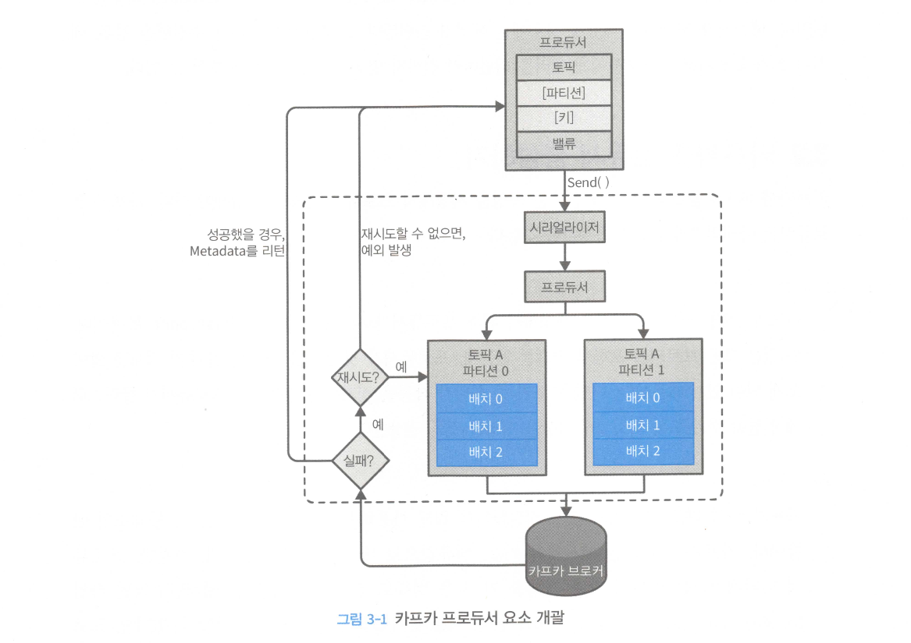
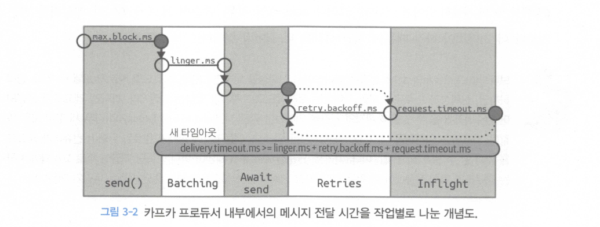
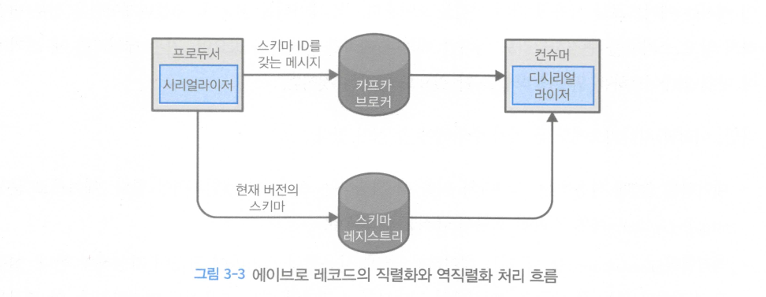
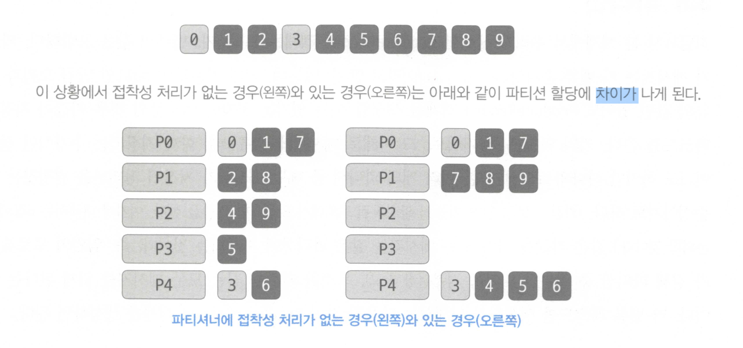

## 카프카 프로듀서

### 카프카 프로듀서 개괄

* 프로듀서가 브로커에 메세지 전송 과정
    * 키와 파티션은 선택사항
    * 키와 값을 직렬화 후 바이트 배열 변환.
    * 파티션을 지정하지 않은경우 파티셔너 통해 파티션이 결정되고 레코드 배치에 추가.
    * 별도의 쓰레드가 카프카 브로커에게 전송.
    * 브로커는 메세지 응답을 돌려준다 성공의 경우 RecordMetadata 정보를 리턴한다.(토픽,파티션,레코드 오프셋) 에러인 경우 에러를 리턴한다.
    * 에러를 받은 경우 몇번 더 재전송을 시도 할수 있다.

~~~java
  Properties kafkaProps=new Properties();
        kafkaProps.put("bootstrap.servers","broker1:9092,broker2:9092");
        kafkaProps.put("key.serializer","org.apache.kafka.common.serialization.StringSerializer");
        kafkaProps.put("value.serializer","org.apache.kafka.common.serialization.StringSerializer");
        KafkaProducer<String, String> producer.=new KafkaProducer<String, String>(kafkaProps);
~~~

## 카프카로 메세지 전달하기

* 보내고 잊어 버리기.
    * 성능 상으로 가장 우수함.
    * 에러를 어느 정도 허용하는 경우 사용가능.

~~~java
    ProducerRecord<String, String> record=newProducerRecord◇("CustomerCountry","PrecisiDnProducts","France");
        try{
        producer.send(record);
        }catch(Exception e){
        e.printstackTrace();
        }
~~~

* 동기적으로 메세지 전송하기
    * RecordMetadata 객체를 통해 메타정보를 알수 있다.
    * 실제로는 잘 사용되지 않는 패턴 성능상으로 좋지 않음.

~~~java
    ProducerRecord<String, String> record=newProducerRecord◇("CustomerCountry","PrecisiDnProducts","France");
        try{
        producer.send(record).get();
        }catch(Exception e){
        e.printstackTrace();
        }
~~~

* 비동기적으로 메세지 전송하기
    * RecordMetadata 객체를 통해 메타정보를 알수 있다.
    * 동일한 메인 쓰레드에서 콜백을 처리함.
    * 콜백에 무거운 로직을 넣는 것은 좋지 않음.
    * 무거운 로직을 넣는경우 별도의 쓰레드 사용 필요.

~~~java
private class DemoProducerCallback implements Callback {
    @Override
    public void onCompletion(RecordMetadata recordMetadata, Exception e) {
        if (e != null) {
            e.printstackTrace();
        }
    }
}

    ProducerRecord<String, String> record = new ProducerRecord<>("CustomerCountry", "BiomedicalMaterials", "USA");
producer.send(record,new DemoProducerCallback());
~~~

## 프로듀서 설정하기

* acks 설정에 따라 성능과 안전성 트레이드 오프함.

| 파라미터      | 용도                                                                                 | 기본값      |                   
|-----------|------------------------------------------------------------------------------------|----------|                   
| client.id | 로그를 확인 확인 하기 위해 필요.                                                                | 임의적으로 배정 |                   
| acks      | 0(브로커 응답을 확인하지 않음.) 1(단일 브로커 응답을 확인함.) -1(in-sync replica 설정된 만큼의 모든 브로커로 응답을 받음.) | 1        |

### 메세지 전달 시간

| 파라미터                                   | 용도                                                                                                      | 기본값  |                   
|----------------------------------------|---------------------------------------------------------------------------------------------------------|------|                   
| max.block.ms                           | 프로듀서가 얼마나 오랫동안 블록되는지를 결정                                                                                |      |                   
| delivery.timeout.ms                    | 브로커 응답을 받거나 전송을 포기하게 되는 제한시간 ( linger.ms + request.timeout.ms + retry.backoff.mns )                     |      |
| request.timeout.ms                     | 프로듀서가 데이터를 전송할 때 서버로부터 응딥을 받기 위해 얼마나 기다릴 것인지를 결정                                                        |      |
| retry, retry.backoff.ms                | 재시도 대기 시간, 재시도를 끄는 방법은 retry=0으로 설정 한다. 기본값 사용을 권장                                                      |      |
| linger.ms                              | 현재 배치를 전송하기 전꺄제 대기하는 시간                                                                                 |      |
| buffer.memory                          | 프로듀서 메시지를 전송 전에 메시지를 대기시키는 버퍼의크기 버퍼가 다차면 max.block.ms 만큼 대기 후 예외 발생                                     |      |
| compression.type                       | 압축 타입 설정 저장하지 않은 경우 기본은 압축하지 않은 상태로 전송 하지만 gzip 또는 snappy 가능                                            |      |
| batch.size                             | 다수의 레코드를 배치단위로 모아서 한꺼번에 전송. 작게 유지하면 자주 보내지만 네트워크 오버해드가 발생.                                              |      |
| max.in.flight.requests.per..connection | 프로듀서가 서버로부터 응딥을 받지 못한 상태에서 전송할 수 있는 최대 메시지의 수 를 결정 기본값으로도 충분한 성능을 보장 순가보장이 필요한 경우 1로 유지필요.              | 1    |
| max.request.size                       | 프로듀서가 전송하는 쓰기 요청의 크기를 결정                                                                                | 1mb  |
| receive.buffer.bytes                   | 매개변수는 데이터를 읽거나 쓸 때 소켓socket이 사용하는 TCP 송수신 버퍼의 크기                                                        | -1   |
| enable.idempotence                     | 0.11 부터 키프카는‘정확히한번' 재시도 하더라도 순차적으로 번호를 붙어 보내며 동일한 번호를 가진 레코드를 2개 이상 받을 경우 DuplicatesequenceException 리턴 | true |

### 커스텀 시리얼라이저 및 Avro

* 커스텀 시리얼라이저

### Avro

* 프로듀서

~~~java

    Properties props=new Properties();
        props.put("bootstrap.servers","localhost:9092");
        props.put("key.serializer","io.confluent.kafka.serializers.KafkaAvroserializer");
        props.put("value.serializer","io.confluent.kafka.serializers.KafkaAvroserializer");
        props.put("schema.registry.url",schemaUrl);

        String topic = "customerContacts";

        Producer<string, Customer> producer=new KafkaProducer<>(props);

        // we keep producing new events until someone ctr1-c 
        while(true){
            Customer customer = CustomerGenerator.getNext();
            System.out.println("Generatedcustomer",customer.tostring());
            ProducerRecord<string, Customer> record = new ProducerRecor<>(topic,customer.getName(),customer);
            producer.send(record);
        }

~~~

* 컨슈머

~~~java

    Properties props=new Properties();
        props.put("bootstrap.servers","localhost:9092");
        props.put("key.serializer",,"io.confluent.kafka.serializers.KafkaAvroserializer");
        props.put("va1ue.serializer","io.confluent.kafka.serializers.KafkaAvroserializer");
        props.put("schema.registry.url",url);

        String SchemaString=
        "{\"namespace\" : \"customerManagement.avro\", "+
        "\"type\":\"record\","+
        "\"name\" : \"Customer\","+
        "\"fields\": ["+
        "{\"name\" :\"id\",\"type\" : \"int\"},"+
        "{\"name\" : \"name\", \"type\" :\"string\"},"+
        "{\"name\" : \"emai\", \"type\": "+"[\"nul\",\"string\"], "+"(\"default\" :\"null\" }"+
        "]}";

        Producer<string, GenericRecord> producer = new KafkaProducer<>(props);

        Schema.Parser parser=new Schema.Parser();
        Schema schema=parser.parse(schemastring);

        for(int nCustomers=0; nCustomers < customers; nCustomers++){
          String name="exampleCustomer" + nCustomers;
          String email="example"+nCustomers+"@example.com";
          GenericRecord customer = new GenericData.Record(Schema);
          customer.put("id",nCustomers);
          customer.put("name",name);
          customer.put("email",email);
          ProducerRecord<String, GenericRecord> data = new ProducerRecord<>("customercontacts",name,customer);
          producer.send(data);
        }

~~~

### 파티션

* 키 하나의 토픽에 속한 여러 개의 파티션중 저장 될 파티션을 결정짓는 기준.
* 키가 없는 현재 운영 중이 파티셔중 하나에(라운드 로빈 정책) 랜덤으로 균형적으로 저장됨.

* 키가 있는 경우 키값을 해시한 결과 기준으로 파티션에 저장됨.
* 동일한 키는 동일한 파티션에 저장되는 원칙.
* UniformstickyPartitioner 전체 파티션에 대해서 균등한 분포를 가지도록 파티션이 할당됨.
* 키를 가지는 파티션을 설계할 경우 리벨런싱을 피하기 위해 충분한 파티션을 가지도록 설계 한다.
* 특수 요구 사항일 경우만 커스텀 파티셔너를 만든다. 대부분 요구사항에 필요하지 않음.

~~~java
import org.apache.kafka.Clients.producer.Partitloner;
import org.apache.kafka.common.CIuster;
import org.apache.kafka.common.Partitionlnfo;
import org.apache.kafka.common.record.Inva1idRecordException;
import org.apache.kafka.common.uti1s.Utils;

public class BananaPartitioner implements Partitioner {
    public void configure(Map<string, ?> configs) {
    }

    public int partition(String topic, Object key, byte[] keyBytes, Object value, byte[] valueBytes, Cluster cluster) {
        List<Partitionlnfo> partitions = cluster.partitionsForTopic(topic);
        int numPartitions = partitions.size();
        if ((keyBytes == null) || (!(key instanceOf string)))
        throw new InvalidRecordException("WeexpectaUmessages " + "tohavecustomernameaskey");
        if (((string) key).equals("Banana"))
            return numPartitions - 1; //Bananawillalwaysgoto1astpartition
        // other records will get hashed to the rest of the partitions
        retum Math.abs(Utils.murmur2(keyBytes)) % (numPartitions - 1);
    }

    public void Close() {
    }
}
~~~

### 헤더

* 레코드는 키값 밸류값 외에도 헤더를 포힘할 수 있다 레코드 헤더는 카프카 레코드의 키/밸류값울 건드리지 않고 추가 메타데이터를 심을 때 사용
* 헤더의 주된용도 중 하나는 메시지의 전달내용을 기록하는 것이댜 즉 데이터가 생성된 곳의 정보를 헤더에 저장해 두면,
* 메시지를 파싱할 필요 없이 헤더에 심어진 정보만으로 메시지를 리우팅 하거나 출처를 추적할 수 있음.

### 인터셉터

* 클라이언트의 코드를 고치지 않으면서 그 작동을 변경해야 할떄 사용.
* ProducerRecord<K, V> onSend(ProducerRecord<K, V> record) 이 메서드는 프로듀서가 레코드를 브로커로 보내기 전, 직렬화되기 직전에 호출된다.
* 이 메서드를 재정의 할때는 보내질 레코드에 딤킨 정보를 볼수있을 뿐만 아니라 고칠수도 있댜.
* 이 메서드에서 유효한 ProducerRecord를 리턴하도록 주의 하기만 하면된다.
* void onAcknowledgement(RecordMetadata metadata, Exception exception) 이 메서드는 키프카 브로커가 보낸 응딥을 클라이언트가 받았을때 호출된댜.
* 브로커가 보낸 응답을 변경할 수는없지만 그안에 담긴 정보는 읽을 수 있다.

### 쿼터,스로틀링

* 기본 프로듀서 쓰기 제한 : quota.producer.default=2M
* 특정 클라이언트 아이디 쓰기 제한 : quota.producer.override="clientA:4M, clientB:10M" ( 보안 기능과 클라이언트 인증 authentication 기능이 활성화되어 있는 클라이언트만 가능)
* -produce-throttle-time-avg, -produce=throttle=time=max, - fetch-throttle-time-avg, -fetch-throttle-time-max 통해 모니터링 가능.