# 서비스: 클라이언트가 파드를 검색하고 통신을 가능하게 함

> 학습 목표
> - 단일 주소로 파드를 노출하는 서비스 리소스 만들기
> - 클러스터 안에서 서비스 검색
> - 클러스터 내에서 외부 서비스 접속
> - 파드가 서비스할 준비가 됐는지 제어하는 방법
> - 서비스 문제 해결

## 서비스 소개

`서비스(Service)`는 동일한 서비스를 제공하는 파드 그룹에 지속적인 단일 접점을 만들려고 할 때 생성하는 리소스다. 쿠버네티스 환경에서는 아래와 같은 이유로 파드를 찾는 리소스가 필요하다.

- 파드는 일시적임, 장애로 제거되고 다시 생성되고 새로운 노드로 이동할 수 있음
- 쿠버네티스는 노드에 파드를 스케줄링한 후 파드가 시작되기 바로 전에 파드의 IP주소를 할당함. 따라서 클라이언트는 서버인 파드의 IP 주소를 미리 알 수 없음
- 여러 파드가 동일한 서비스를 제공할 때 클라이언트는 파드의 개별 IP 목록을 유지해야하는 불편함이 생길 수 있음

### 서비스 생성

- 서비스를 생성하는 방법
  - `kubectl expose` 명령어로 생성
  - YAML 디스크립터를 통한 서비스 생성

#### 서비스 생성 YAML

```yaml
apiVersion: v1
kind: Service
metadata:
  name: kubia
spec:
  ports:
  - port: 80
    targetPort: 8080
  selector: # 레이블 셀렉터를(Label Selector)를 통해서 어떤 파드가 서비스에 속할지 정함
    app: kubia
```

#### 서비스 조회

```shell
$ kubectl get svc
NAME         TYPE        CLUSTER-IP       EXTERNAL-IP   PORT(S)   AGE
kubernetes   ClusterIP   10.96.0.1        <none>        443/TCP   63s
kubia        ClusterIP   10.111.249.153   <none>        80/TCP    5s
```

#### 서비스 연결 테스트

```shell
$ kubectl exec kubia-7nogl -- curl -5 http://10.111.249.153
```
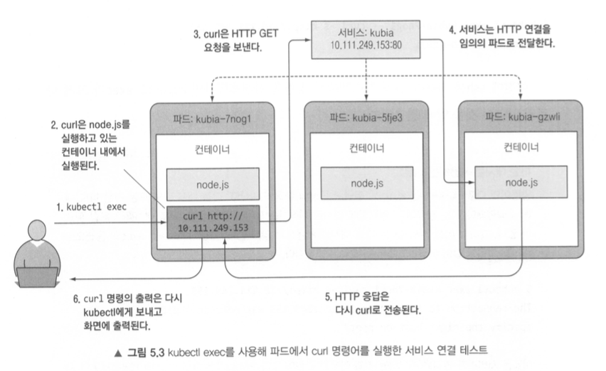

#### 서비스의 세션 어피니티 구성

동일한 명령을 여러번 실행하면 동일한 클라이언트에서 요청하더라도 서비스 프록시가 각 연결을 임의의 파드로 전달한다. **클라이언트의 모든 요청을 매번 같은 파드로 리디렉션** 하려면 서비스의 세션 어피니티 속성을 `ClientIP`로 설정한다.

```yaml
apiVersion: v1
kind: Service
metadata:
  name: kubia
spec:
  sessionAffinity: ClientIP
```

#### 동일한 서비스에서 여러 개의 포트 노출

하나의 서비스를 사용해 멀티 포트를 노출할 수 있다. 여러 포트가 있는 서비스를 만들 때는 각 포트의 이름을 지정해야한다.

```yaml
apiVersion: v1
kind: Service
metadata:
  name: kubia
spec:
  ports:
  - name: http 
    port: 80
    targetPort: 8080
  - name: https
    port: 443
    targetPort: 8443
  selector:
    app: kubia
```

#### 이름이 지정된 포트 사용

포트 이름을 사용하면 나중에 서비스 스펙을 변경하지 않고도 포트 번호를 쉽게 변경할 수 있다. 

```yaml
apiVersion: v1
kind: Service
metadata:
  name: kubia
spec:
  ports:
    - name: http
      port: 80
      targetPort: http
    - name: https
      port: 443
      targetPort: https
  selector:
    app: kubia
```

### 서비스 검색

서비스를 만들면 파드에서 액세스 할 수 있는 안정적인 IP 주소와 포드가 생긴다. 이 주소는 서비스가 유지되는 동안 변경되지 않는다. 쿠버네티스는 클라이언트 파드가 서비스의 IP와 포트를 검색할 수 있는 방법을 제공한다.

#### 환경변수를 통한 서비스 검색

파드가 시작되면 쿠버네티스는 해당 시점에 존재하는 각 서비스를 가르키는 환경변수 세트를 초기화 한다. 클라이언트 파드를 생성하기 전에 서비스를 생성하면 해당 파드의 프로세스는 환경변수를 검사해 서비스의 IP 주소와 포트를 얻을 수 있다.

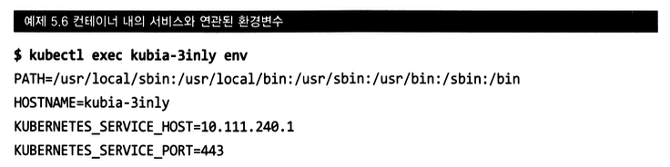

#### DNS를 통한 서비스 검색

쿠버네티스의 각 컨테이너는 `/etc/resolve.conf` 파일을 수정하여 `kube-system` 네임스페이스에 있는 `kube-dns` 파드를 DNS 서버로 사용하도록 자동 구성된다. 파드에서 실행 중인 프로세스에서 수행된 모든 DNS 쿼리는 시스템에서 실행 중인 모든 서비스를 알고 있는 쿠버네티스 자체 DNS 서버로 처리된다.

#### FQDN(Fully Qualified Domain Name)을 통한 서비스 연결

```shell
<서비스 이름>.<네임스페이스>.svc.cluster.local
backend-database.default.svc.cluster.local
```

## 클러스터 외부에 있는 서비스 연결

- 서비스가 클러스터 내에 있는 파드로 연결을 전달하는 것이 아니라, 외부 IP와 포트로 연결을 전달하도록 설정할 수도 있다.
- 서비스는 파드와 직접 연결 되지 않고 엔드포인트라는 리소스를 사용한다.
- 앤드포인트 리소스는 서비스로 노출되는 파드의 IP 주소와 포트 목록이다.

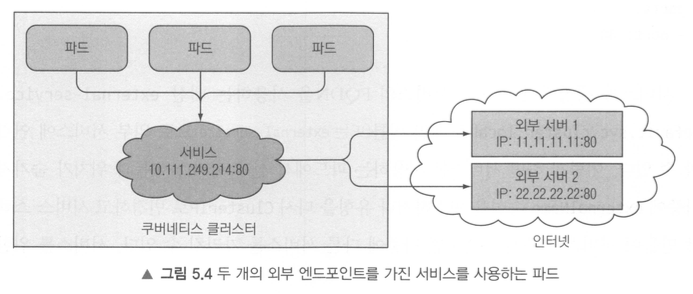

## 외부 클라이언트에 서비스 노출

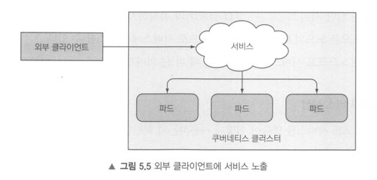

프론트엔드 웹 서버와 같은 특정 서비스를 외부에 노출해 클라이언트가 액세스할 수 있도록 설정 할 수 있다.

* 서비스 유형을 **노드포트** 설정
* 서비스 유형을 노드포트 유형의 확장인 **로드밸런서**로 설정
* 단일 IP 주소로 여러 서비스를 노출하는 인그레스 리소스 만들기

### 노드포트 서비스 사용

```yaml
apiVersion: v1
kind: Service
metadata:
  name: kubia-nodeport
spec:
  type: NodePort # 서비스 유형을 노드포트로 설정
  ports:
  - port: 80 # 서비스 내부 클러스터 IP의 포트
    targetPort: 8080 # 서비스 대상 파드의 포트
    nodePort: 30123 # 각 클러스터 노드의 포트 30123으로 서비스에 액세스 할 수 있음
  selector:
    app: kubia
```
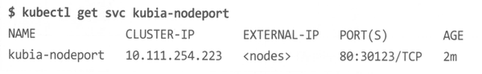
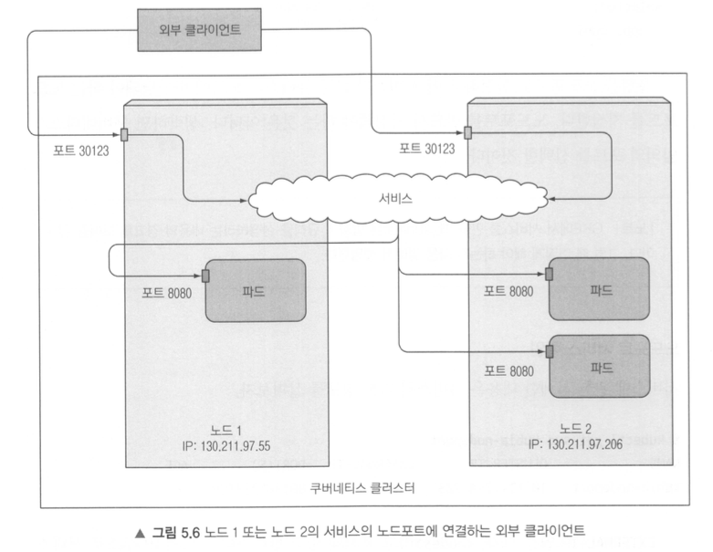

* 클라우드 공급자(AWs, GCP, Azure)에서 구동되는 쿠버네티스의 경우 노드포트로 서비스에 액세스하려면 해당 노드포트에 대한 외부 연결을 허용하도록 방화벽 설정이 필요함
* 클라이언트가 특정 노드에만 요청을 보내는 것은 장애에 취약함
* 모든 노드에 요청을 분산 시킬 수 있도록 노드 앞에 로드밸런서를 배치하는 것이 좋음

### 외부 로드밸런서로 서비스 노출

* 클라우드 공급자에서 실행되는 쿠버네티스 클러스터는 일반적으로 클라우드 인프라에서 로드밸런서를 자동으로 프로비저닝하는 기능을 제공
* 노드포트 대신 서비스 유형을 로드밸런서로 설정하기만 하면 됨

```yaml
apiVersion: v1
kind: Service
metadata:
  name: kubia-loadbalancer
spec:
  type: LoadBalancer
  ports:
  - port: 80
    targetPort: 8080
  selector:
    app: kubia
```
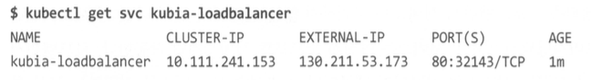
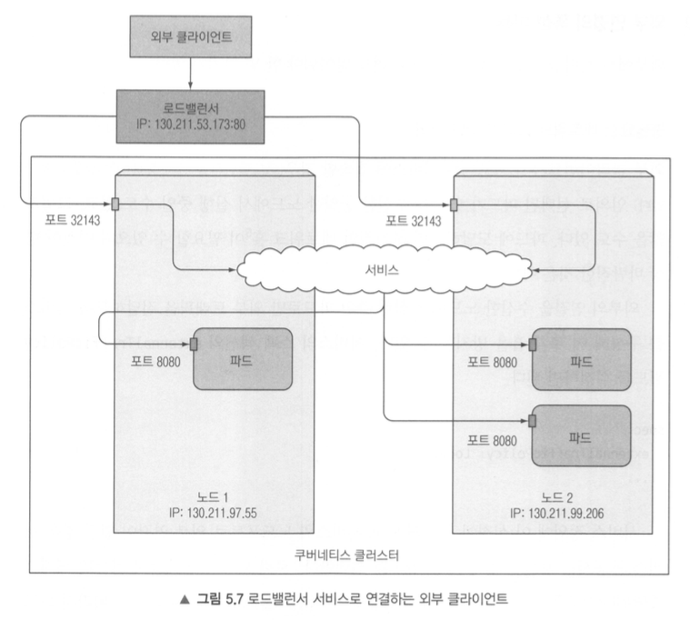

### 인그레스 리소스로 서비스 외부 노출

* 한 IP 주소로 수십 개의 서비스에 접근이 가능하도록 지원함
  * 동일한 호스트의 다른 경로로 여러 서비스를 매핑할 수 있음
  * 서로 다른 호스트로 서로 다른 서비스를 매핑할 수 있음
* 인그레스는 L7에서 작동하여 서비스가 할 수 없는 쿠키 기반 세션 어피니티 등과 같은 기능을 제공함
* TLS 트래픽을 처리하도록 인그레스 구성 가능

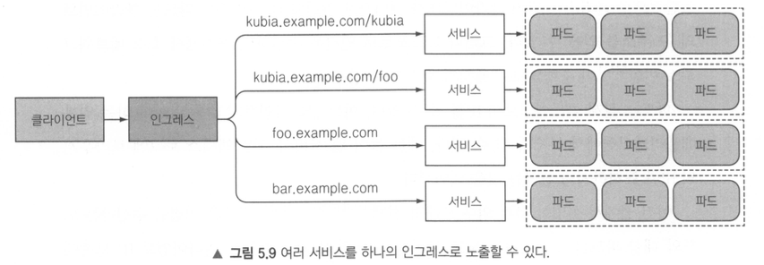
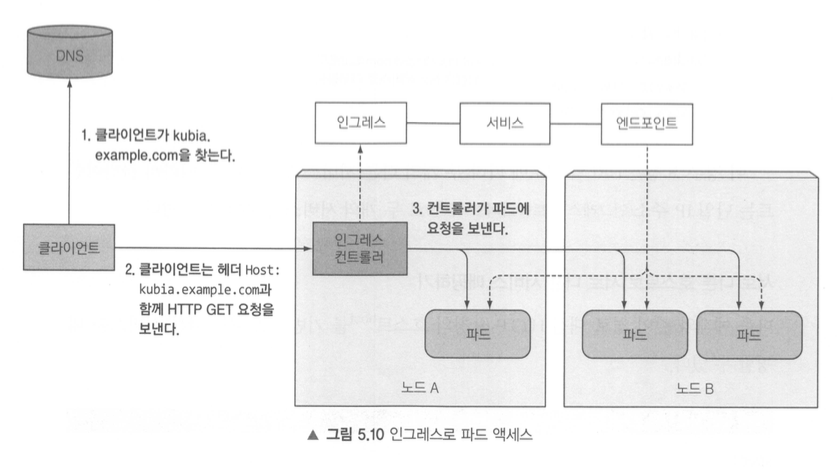


## 레디니스 프로브(Readiness Probe)

* 주기적으로 호출되며 특정 파드가 클라이언트 요청을 수신할 수 있는지 결정함
* 준비가 된 파드에만 트래픽을 전달함

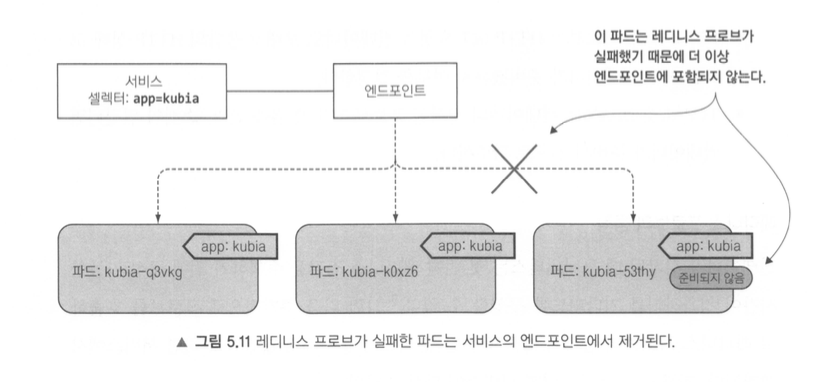

### 레디니스 프로브 유형

* Exec 프로브 : 프로세스의 종료 상태 코드로 결정
* HTTP GET 프로브 : 컨테이너로 HTTP GET 요청을 보내고 응답 상태 코드를 보고 결정
* TCP 소켓 프로브 : 컨테이너의 지정된 포트로 TCP 연결을 열고 열결 성공여부로 결정


```yaml
apiVersion: v1
kind: ReplicationController
metadata:
  name: kubia
spec:
  replicas: 3
  selector:
    app: kubia
  template:
    metadata:
      labels:
        app: kubia
    spec:
      containers:
      - name: kubia
        image: luksa/kubia
        ports:
        - name: http
          containerPort: 8080
        readinessProbe:
          exec:
            command:
            - ls
            - /var/ready
```
